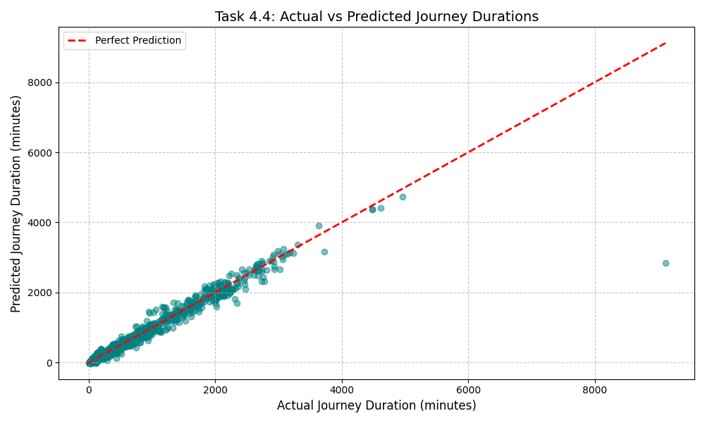

# Task 4: Model Training and Evaluation

## Task 4.1: Data Splitting
The processed dataset (`Dataset1_processed.csv`) was split into training and testing sets using a standard 80/20 split. This ensures the model is trained on 80% of the data and evaluated on the remaining unseen 20% to accurately gauge real-world performance.

## Task 4.2: Model Training
A **Linear Regression** model was trained using the training data. The features used to predict the journey duration were:
- `Total_Distance`
- `Number_of_Stops`
- `Start_Departure_Minute`
- `End_Arrival_Minute`

## Task 4.3: Model Evaluation
The model's predictions on the test set were evaluated using standard error metrics:
- **Mean Absolute Error (MAE):** 58.58 minutes
- **Root Mean Squared Error (RMSE):** 157.52 minutes

*Interpretation:* On average, the Linear Regression model's predictions are off by about 58.5 minutes. The higher RMSE indicates that there are some significant outlier predictions where the model was further off.

## Task 4.4: Visualizing Predictions
A scatter plot was generated to compare the actual journey durations against the model's predicted durations. The red dashed line represents a "perfect prediction" scenario where Predicted = Actual.

*Observation:* While the model generally follows the trend line, there is noticeable spread (variance) especially for mid-to-long duration journeys, suggesting that a simple Linear Regression model might be too basic, or additional features are needed to capture the complexity of train schedules.
