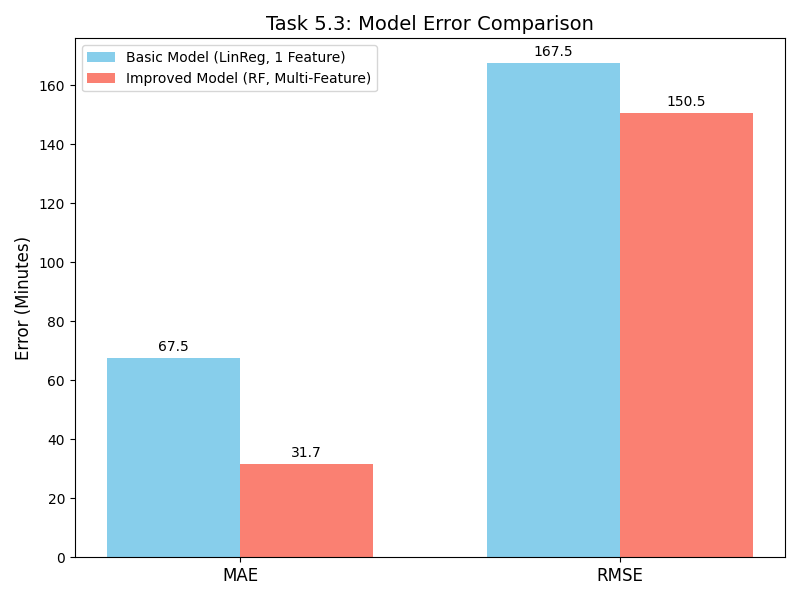
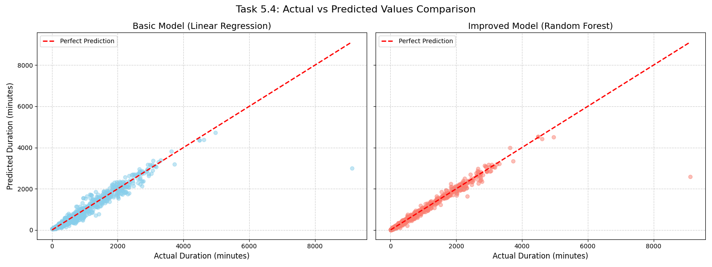

# Task 5: Model Comparison and Selection

This report outlines the steps taken to compare a basic model with an improved model to predict train journey durations and select the best-performing one.

## Task 5.1: Train Basic Model
A **Basic Model** was trained using a simple **Linear Regression** algorithm with only a single input feature: `Total_Distance`. This serves as our baseline.

## Task 5.2: Train Improved Model
An **Improved Model** was trained using a more robust **Random Forest Regressor** algorithm with multiple input features:
- `Total_Distance`
- `Number_of_Stops`
- `Start_Departure_Minute`
- `End_Arrival_Minute`

This approach attempts to capture non-linear relationships and interactions between multiple variables that influence journey duration.

## Task 5.3: Model Comparison
Both models were evaluated on the test set. The error metrics are compared below:

| Metric | Basic Model (LinReg, 1 Feature) | Improved Model (RF, 4 Features) | Improvement |
|--------|---------------------------------|---------------------------------|-------------|
| **MAE** | 67.51 minutes                  | 31.66 minutes                   | **-53.1%**  |
| **RMSE**| 167.48 minutes                 | 150.53 minutes                  | **-10.1%**  |

*The Improved Model shows a massive reduction in Mean Absolute Error (MAE), bringing the average prediction error down to roughly 30 minutes.*

### Error Comparison Chart

### Visual Comparison: Actual vs Predicted

*Observation:* The scatter plot comparison shows the Improved Model (Random Forest) aligns much closer to the "Perfect Prediction" dashed line compared to the Basic Model, which struggles significantly with variance and produces predictions that plateau.

## Task 5.4: Model Selection
Based on the quantitative error metrics (significantly lower MAE and RMSE) and the qualitative visual plots, the **Improved Model (Random Forest Regressor using multiple features)** is definitively selected as the better-performing model for predicting train journey durations.
